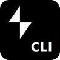

# Slack CLI 

[](https://github.com/slackapi/slack-cli/actions/workflows/tests.yml)
[](https://codecov.io/gh/slackapi/slack-cli)
[](https://dl.circleci.com/status-badge/redirect/gh/slackapi/slack-cli/tree/main)

> Command-line interface for building apps on the Slack Platform.

## :wave: Welcome

Welcome to the Slack Platform! This is the source code for command-line
interface (CLI), which is your doorway to a new way of building Slack apps.

## :books: Download

To get started, choose the type of build you want:

- **:package: Get latest release**
  - [Latest Stable Release][install] to download the latest official release for
    macOS, Windows, and Linux
  - [Browse Previous Releases][releases] to download any previous release for
    macOS, Windows, and Linux
- **:zap: Get latest development build**
  - [Browse Development Build][dev] to download the latest signed build from
    `main`
- **:hammer_and_wrench: Build from source**
  - [Browse our Maintainers' Guide][maintainers] to clone, build, and run the
    source code

## :computer: Usage

Visit our ✨ [CLI Reference Documentation][commands] to learn about each
command.

You can also explore each command through the terminal:

```zsh
$ slack --help
$ slack [command] --help
$ slack help [command]
```

> :bulb: Remember, development builds must run the binary as `./bin/slack`

## :hammer_and_wrench: Contributions

We'd love to hear from you, whether it's a :hammer_and_wrench:
[pull request][maintainers], :bug: [bug report][issues], :sparkles:
[suggestion][suggestions], or :rocket: [improvement][enhancements]. Feel free to
submit an issue or pull request to start a discussion!

## :wave: Farewell

Thanks for stopping by! You're awesome :sunglasses:

[commands]: https://tools.slack.dev/slack-cli/reference/commands/slack
[dev]: https://github.com/slackapi/slack-cli/releases/tag/dev-build
[enhancements]: https://github.com/slackapi/slack-cli/pulls
[install]: https://tools.slack.dev/slack-cli/guides/installing-the-slack-cli-for-mac-and-linux
[issues]: https://github.com/slackapi/slack-cli/issues/new?template=04_bug.md
[maintainers]: .github/MAINTAINERS_GUIDE.md
[releases]: https://github.com/slackapi/slack-cli/releases
[suggestions]: https://github.com/slackapi/slack-cli/issues/new?template=02_enhancement.md
